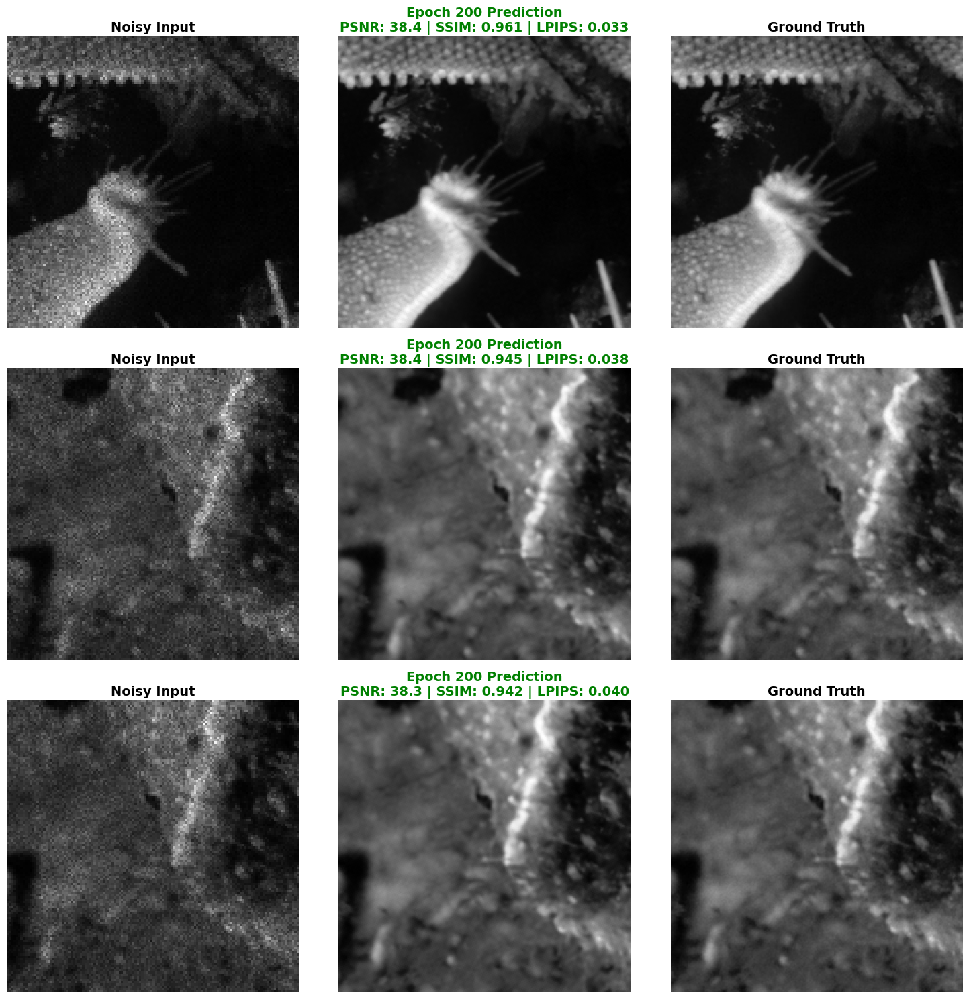

# Acuity: Image Noise Reduction & Super-Resolution

This repository implements a joint denoising and super-resolution pipeline targeting multiplicative speckle and additive Gaussian noise. 

## 🎯 Reviewer Quick Start (Evaluation)
To instantly evaluate our model on a fresh machine (e.g., Google Colab), run the following commands. This will clone the repository, download the trained model, and run the automated evaluation script (`evaluate.py`) on the test dataset.

```bash
# 1. Clone the repository
git clone https://github.com/venkatesh21bit/Acuity.git
cd Acuity

# 2. Install dependencies
pip install -r requirements.txt

# 3. Download the 318MB trained model via Git LFS
git lfs pull

# 4. Run the automated evaluation script
python evaluate.py --input dataset/Test_NoisyLR/NoisyLR --output reviewer_results
```
*Note: The script automatically loads `checkpoint/latest_epoch200.pth`. The restored images will be saved in the `reviewer_results/` folder.*


## 🌟 Results


## 🧠 Approach

Restoring signal-degraded, downsampled images containing multiplicative speckle and additive Gaussian noise requires a specialized approach. Our solution combines three major innovations:

1. **Nonlinear Activation-Free Network (NAFNet)**: Replaces traditional nonlinearities (ReLU/GELU) with SimpleGate and Simplified Channel Attention (SCA). This provides massive representation power while being exceptionally computationally efficient.
2. **Logarithmic Variance Stabilizing Transformation (LogVST)**: Multiplicative speckle noise is extremely difficult for neural networks to learn directly. We apply a LogVST to the raw 32-bit floating-point input tensors to decouple the noise variance from the signal intensity, effectively transforming the speckle into manageable additive-like noise.
3. **Compound Loss with Homoscedastic Uncertainty Weighting**: Instead of relying on a single loss function, we use a multi-objective optimization (MOO) strategy. 
   - **Charbonnier Loss**: A smooth L1 variant for robust pixel-wise fidelity.
   - **MS-SSIM**: Preserves multi-scale structural integrity and contrast.
   - **LPIPS (VGG-16)**: Recovers high-frequency perceptual textures.
   - **Sobel Gradient Loss**: Penalizes edge blurring.

   The loss weights are dynamically balanced during training using learnable Homoscedastic Uncertainty parameters (`log_vars`).

## 🏗️ Architecture Diagram

```mermaid
graph TD
    A[Input LR Noisy Image<br>128x128] --> B[LogVST<br>Variance Stabilization]
    B --> C[Stem: 3x3 Conv]
    
    subgraph Encoder [Encoder path]
        C --> D1[NAFBlock x2]
        D1 --> E1[Conv stride=2]
        E1 --> D2[NAFBlock x2]
        D2 --> E2[Conv stride=2]
        E2 --> D3[NAFBlock x4]
        D3 --> E3[Conv stride=2]
        E3 --> D4[NAFBlock x8]
        D4 --> E4[Conv stride=2]
    end
    
    E4 --> F[Bottleneck NAFBlock x4]
    
    subgraph Decoder [Decoder path with Skips]
        F --> G1[ConvTranspose stride=2]
        G1 -. concat with D4 .-> H1[NAFBlock x2]
        
        H1 --> G2[ConvTranspose stride=2]
        G2 -. concat with D3 .-> H2[NAFBlock x2]
        
        H2 --> G3[ConvTranspose stride=2]
        G3 -. concat with D2 .-> H3[NAFBlock x2]
        
        H3 --> G4[ConvTranspose stride=2]
        G4 -. concat with D1 .-> H4[NAFBlock x2]
    end
    
    H4 --> I[PixelShufflePack r=2<br>Sub-Pixel Conv]
    I --> J[SoftClip alpha=10<br>Smooth Boundary]
    J --> K[Output HR Clean Image<br>256x256]
    
    classDef main fill:#2c3e50,stroke:#34495e,stroke-width:2px,color:#ecf0f1
    classDef sub fill:#34495e,stroke:#2c3e50,stroke-width:2px,color:#ecf0f1
    class A,K main
    class B,C,F,I,J sub
```



## 🚀 Setup & Training

### 1. Requirements
Ensure you have Python 3.10+ installed. Install the required dependencies:
```bash
pip install -r requirements.txt
```

### 2. Dataset Preparation
The dataset must contain the High-Resolution Ground Truth (GT) and Low-Resolution Noisy (LR) pairs.
Update the paths in `configs/train.yaml`:
```yaml
data:
  train_gt_dir: "/path/to/train/gt"
  train_lr_dir: "/path/to/train/noisy"
  val_gt_dir: "/path/to/val/gt"
  val_lr_dir: "/path/to/val/noisy"
```

### 3. Training
To start training from scratch:
```bash
python train.py --config configs/train.yaml
```

To quickly verify that your environment is working without running a full training loop:
```bash
python train.py --config configs/train.yaml --overfit-batch
```

### 4. Inference
To run inference on a folder of noisy images (e.g., for benchmarking):
```bash
python evaluate.py --input /path/to/test_images --output /path/to/results --ckpt checkpoints/latest_epoch200.pth
```

## ⚡ Running on H100 GPUs

The current setup uses `float32` by default to ensure stability on older GPUs like the T4. However, the NVIDIA H100 GPU natively supports `bfloat16` and highly advanced Tensor Cores. 

To achieve maximum performance on an **H100**, make the following changes in `configs/train.yaml` (or your Colab notebook):

1. **Enable BFloat16**: Change `amp_dtype` to `"bfloat16"`. This eliminates NaN overflow issues while doubling memory bandwidth and speed.
   ```yaml
   train:
     amp_dtype: "bfloat16"
   ```
2. **Increase Batch Size**: The H100 has 80GB of VRAM. You can massively increase the batch size to fully utilize the GPU.
   ```yaml
   train:
     batch_size: 64   # or 128
   ```
3. **Enable `torch.compile`**: Enable PyTorch's Inductor compiler to optimize the graph specifically for the H100 Tensor Cores.
   ```yaml
   train:
     compile: true
     compile_mode: "max-autotune-no-cudagraphs"
   ```
